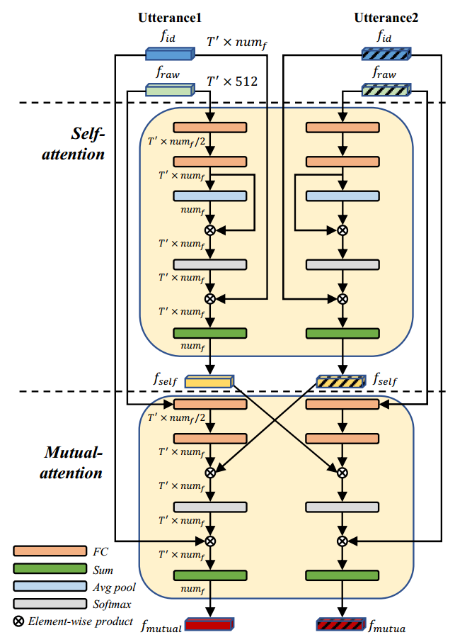

# Text-Independent Speaker Verification with Dual Attention Network

This is the PyTorch implementation of the models in **Text-Independent Speaker Verification with Dual Attention Network**, 
INTERSPEECH2020.

By Jingyu Li, Tan Lee.

[Paper-pdf](https://isca-speech.org/archive/Interspeech_2020/pdfs/2031.pdf)

## Dual attention
<div align=center></div>


## Citation
If you find this work helpful in your project or use our model zoo, please consider citing:
```
@article{li2020text,
  title={Text-Independent Speaker Verification with Dual Attention Network},
  author={Li, Jingyu and Lee, Tan},
  journal={arXiv preprint arXiv:2009.05485},
  year={2020}
}

```
